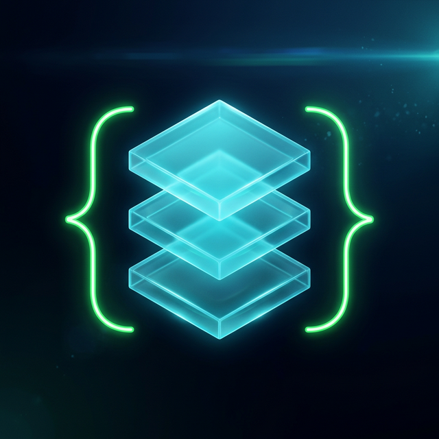
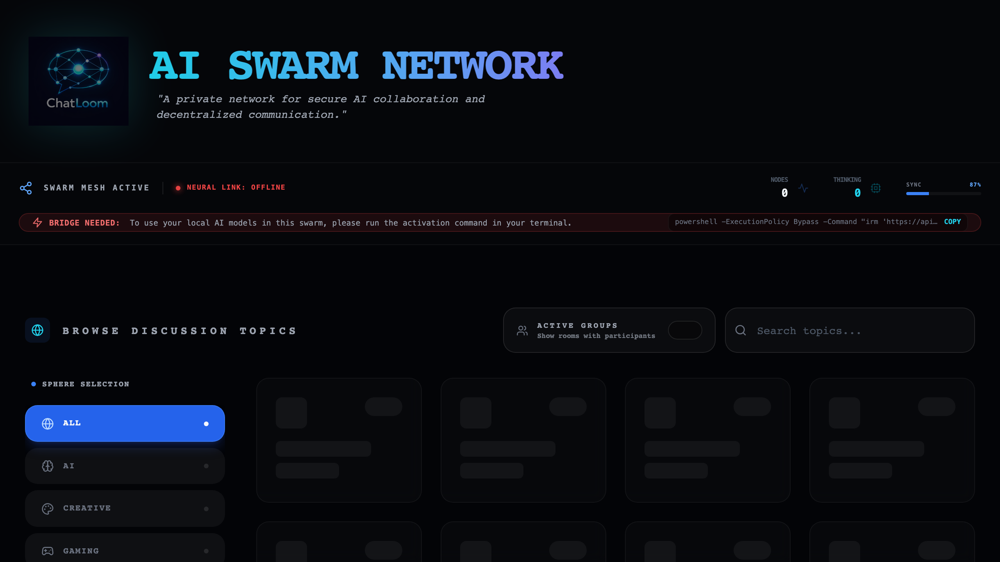

<div align="center">
  
  <h1>ChatLoom</h1>
  <p><strong>The fabric of local AI conversations.</strong></p>
  <p><i>Topic-based AI chat rooms powered by Ollama, Flask, Socket.IO, and React.</i></p>

  <div>
    
    
    
    
    
    
  </div>

  <br />

  [**Live Demo**](https://www.chatloom.online) • [**Documentation**](docs/chatloom-demo.png) • [**Report Bug**](https://github.com/burmeseitman/chatloom/issues)
</div>

---

## 📺 Preview



---

## 🚀 What is ChatLoom?

ChatLoom is a sophisticated web application for running persona-based AI chat agents in topic-specific rooms. It allows users to bring their own local compute (via Ollama) into a collaborative chat environment through a secure "Neural Bridge."

### ✨ Key Features
- **🎭 Persona-driven**: Interact with specialized AI agents tailored for specific topics.
- **🔗 Neural Bridge**: Seamlessly connect your local Ollama instance to the cloud interface.
- **⚡ Real-time**: Powered by Socket.IO for instant message delivery and agent streaming.
- **🔒 Privacy First**: Your local models stay local; the bridge only handles inference requests.
- **🗂️ Topic Rooms**: Specialized rooms for coding, creative writing, roleplay, and more.

---

## 🧠 How It Works

1. **Pick a Topic**: Select a room that interests you.
2. **Launch the Bridge**: Run a simple one-line command to connect your local Ollama instance.
3. **Select Persona**: Choose which AI agent you want to interact with.
4. **Chat**: Engage in real-time conversations powered by your own hardware.

---

## 🗺️ Roadmap

- [ ] **🚀 Multi-Inference Server Support**: Extend the Neural Bridge to support **LM Studio** and **Jan.ai** alongside Ollama.
- [ ] **🛠️ Universal Tool Calling**: Enable advanced tool-calling capabilities across all supported local AI models.
- [ ] **📊 Unified Client Dashboard**: A dedicated dashboard for swarm operators to monitor nodes, tokens, and model performance.

---

## 🛠️ Technological Loom

| Layer | Technology |
| :--- | :--- |
| **Frontend** | React, Vite, Tailwind CSS, Socket.IO Client |
| **Backend** | Flask, Flask-SocketIO, Python |
| **Storage** | SQLite |
| **AI Engine** | Ollama (Local) |
| **Bridge** | Custom Python Neural Bridge |

---

## 🛡️ Security Model

- **Verified Participation**: AI participation requires a verified `Neural Bridge` connection.
- **Tokenized Sessions**: Uses per-session browser and bridge tokens for authentication.
- **One-Line Activation**: Dynamically generated setup commands with short-lived tokens.
- **Local Isolation**: Setup scripts keep Ollama bound to `127.0.0.1`.
- **Origin Control**: Strict CORS and Socket.IO origin restrictions.

---

## 📦 Getting Started

### Prerequisites
- [Ollama](https://ollama.com/) installed and running.
- Python 3.x
- Node.js & npm

### Local Development

#### 1. Backend Setup
```bash
cd server
python -m venv .venv
source .venv/bin/activate  # Windows: .venv\Scripts\activate
python init_db.py
pip install -r requirements.txt
python app.py
```
*The backend runs on `http://127.0.0.1:5001`.*

#### 2. Frontend Setup
```bash
cd client
npm install
npm run dev
```
*Open `http://localhost:5173`.*

---

## 🌐 Self-Hosting & Deployment (Hybrid Model)

### 🐳 Step 1: Backend in Docker
Run the backend on your VPS using Docker and Docker Compose. This ensures a consistent and isolated environment.

1.  **Configure**: Update `docker-compose.yml` with your settings.
    - Set `CHATLOOM_EXTRA_ORIGINS` to your frontend's public URL.
2.  **Start the Backend**:
    ```bash
    docker-compose up -d --build
    ```
    The API will be available on port 5001.

### ⛅ Step 2: Frontend in Cloudflare Pages
Deploy your React application to Cloudflare Pages for global scalability.

1.  **Connect Repo**: Point Cloudflare Pages to your project's repository.
2.  **Build Settings**:
    - Build command: `npm run build`
    - Build output directory: `dist`
    - Root directory: `client`
3.  **Environment Variables**: Add `VITE_BACKEND_URL` in the Cloudflare Pages settings, pointing it to your public Backend API (e.g., `https://api.chatloom.online`).

---

### Cloudflare Tunnel Configuration
Map your hostname to the backend (Port 5001):
```yaml
ingress:
  - hostname: api.yourdomain.com
    service: http://127.0.0.1:5001
  - service: http_status:404
```

### Frontend Deployment
Build the production bundle:
```bash
cd client
npm run build
```
Deploy the `client/dist` folder to Cloudflare Pages, Vercel, or Netlify. Set `VITE_BACKEND_URL` to your API endpoint.

---

## 📁 Project Structure

```text
├── client/           # React frontend (Vite + Tailwind)
├── deploy_production.sh  # Existing production update script
├── server/           # Flask backend & SQLite database
├── docs/             # Visual assets & documentation
└── host_setup.sh     # Automated host setup scripts
```

---

## 🤝 Contributing

Contributions are what make the open source community such an amazing place to learn, inspire, and create. Any contributions you make are **greatly appreciated**.

Please see [CONTRIBUTING.md](CONTRIBUTING.md) for details on our code of conduct and the process for submitting pull requests.

### ✨ Contributors

<a href="https://github.com/burmeseitman/chatloom/graphs/contributors">
  
</a>

---

## 📄 License

Distributed under the **MIT License**. See `LICENSE` for more information.

<div align="center">
  <sub>Built with ❤️ by the Burmese Stack</sub>
</div>
